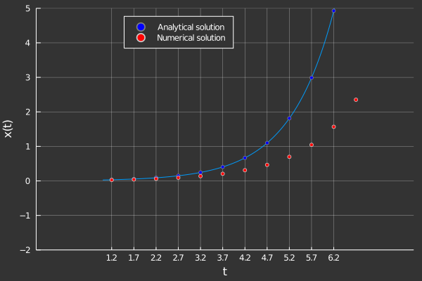

# Introduction & Motivation

---

Consider the following initial value problem (IVP): (perhaps from a perspective where $x(t)$ is a dynamical variable, and $t$ is the time elapsed.)

$$
\boxed{\frac{dx}{dt} = f(x,t)\ \ ; \hspace{1cm} x(t_0) = x_0}
$$

Our aim is to 'solve' this problem. Analytically, this means that we would like to find a closed form expression for the function $x(t) \ \ \forall t \in [0, \infty)$. However, we find that most differential equations may not have simple analytical expressions for their solutions. This motivates us to look for a numerical solution instead where we trade the knowledge of an analytical expression in exchange for the values of the function $x(t)$ at a finite number of time-points $t$.

To begin with, this involves breaking our domain into a discrete set of values, $T_{discrete} = \{t_1,t_2,...,t_N\} \subset [0, \infty)$. In general, the spacing between $t_i$ need not be constant, but for starters, let us say they are evenly spaced. This produces a set of discrete values constructed like so (an arithmetic progression): 

$$
\boxed{t_k = t_1 + (k-1)\Delta t}
$$
Hence, solving this problem is equivalent to obtaining the values $x(t) = \{x_1,x_2,...,x_N\}$ $\equiv \{x(t_1), x(t_2),...,x(t_N)\} \hspace{1cm} \forall t_i \in T_{discrete}.$ 

Euler's method is our first (and simplest) attempt to numerically approximate the solution of this differential equation. After obtaining these values, we can apply specialised interpolation schemes to construct our version of the true solution.

---

## The Euler method

---

From the first principle of derivatives, we have 

$$
\frac{dx}{dt} \bigg |_{t=t_n} = \lim_{\Delta t \to 0} \frac{x(t_n + \Delta t) - x(t_n)}{\Delta t}
$$

We can discretize this, keeping in mind that $\Delta t \to 0$; 

$$
\frac{dx}{dt} \bigg |_{t=t_n} = \frac{x_{n+1} - x_n}{t_{n+1} - t_n} = f(x_n,\ t_n)
$$
Denoting $t_{n+1} - t_n = h$, the equation can be rearranged to give the value of $x_{n+1}$ in terms of $x_n$ like so;

$$
x_{n+1} = x_n + h \cdot f(x_n,\ t_n) \ \ ; \hspace{0.5cm} \forall n \in {1, 2, ..., N}
$$
The above equation gives an iterative scheme, called the forward Euler method. 

---

## A graphical perspective

With a plot, this process can be visualised in a more intuitive manner. In the graph shown below, there is a smooth blue curve which is the solution to some IVP $(\dot{x} = f(x, \ t))$. The dots on the curve represent the points $t_i \in T_{discrete}$, at which we would like to numerically approximate the solution. Using the iteration scheme shown above, the approximate solution at the specified points are shown in red.

Notice that the numerical solution diverges from the analytical solution for larger $t$. This is due to a poorly chosen spacing, $\Delta t$ between the discrete points, which results in an accumulation of error (ideally, we would require $\Delta t \to 0$). 

---

## Numerical errors

While performing any numerical operation, it is necessary to obtain some information about the numerical errors that we introduce by using these approximate iterative schemes to gauge the utility of our approximate solution. For the euler method with fixed discretization, the error analysis involved is fairly straightforward. 

We begin with the taylor expansion of our function $x(t)$ about $t = t_n$, truncated upto first order;

$$x(t_n + \Delta t) = x(t_n) + \left(\frac{dx}{dt}\bigg |_{t = t_n}\right)\Delta t + \mathcal{O}(\Delta t^2)$$

Locally, we see that the error drops off quadratically with $\Delta t$. However, we perform this iterative scheme $N$ times, where $N = \frac{t_f - t_0}{\Delta t}$. 

So, globally the error accumulated is $\mathcal{O}(\Delta t)$.

---
## Implementation
Check out these links to find language-specific implementations of the euler method. 
- [Julia](EulerMethod_Julia.html) version
- [Python](EulerMethod_Python.html) version

---

